# MIND: Model for Ischemic Network Diagnostics

A clinical decision support system for classifying therapeutic window in ischemic stroke patients using radiomics and machine learning.

**Created by:** Andres Felipe Cardozo Gomez

## Overview

MIND is a comprehensive data science and machine learning pipeline designed to assist neurologists at Fundacion Valle del Lili (FVL) in estimating whether a patient with ischemic stroke of unknown onset time falls within the therapeutic window (less than or equal to 4.5 hours). The system leverages radiomic features extracted from non-contrast CT brain scans combined with clinical variables to support critical treatment decisions.

The therapeutic window defines eligibility for thrombolytic therapy, which can significantly reduce disability when administered within 4.5 hours of symptom onset. Up to 25% of stroke patients arrive with unknown onset time, and this system aims to reduce the percentage denied treatment due to temporal uncertainty.

## Objectives

**Primary Objective:**
Develop an auditable, reproducible ML pipeline that classifies patients as within or outside the therapeutic window (4.5 hours) with clinical-grade sensitivity.

**Business KPIs:**

| KPI | Definition | Target |
|-----|------------|--------|
| Clinical Sensitivity (Recall >4.5h) | TP / (TP+FN) for patients actually over window | Greater than or equal to 0.85 |
| Clinical Specificity (Recall <=4.5h) | TN / (TN+FP) for eligible patients | Greater than or equal to 0.70 |
| AUROC Patient-Level | General discrimination | Greater than or equal to 0.80 |
| Data Quality Pass Rate | Rows passing Great Expectations | Greater than or equal to 0.99 |
| DW Freshness | Minutes since last successful load | Less than or equal to 60 |

**Technical Objectives:**
1. Batch ETL orchestrated in Airflow with data lineage
2. Relational Data Warehouse in star schema on PostgreSQL
3. Great Expectations as quality gate between staging and analytics
4. Kafka streaming of operational metrics from the Fact table
5. Static dashboard generated from the DW (not from CSV files)
6. ML model with honest CV (GroupKFold) and model card

## Technology Stack

| Layer | Technology | Justification |
|-------|------------|---------------|
| Language | Python 3.12 | Mature ecosystem, complete tooling |
| Environment | venv + requirements.txt | Reproducible without Docker for local dev |
| Containers | docker-compose | Postgres + Airflow + Kafka + Zookeeper + MLflow |
| Primary Storage | PostgreSQL 16 | Relational DW, sufficient for 74 patients, scalable |
| Secondary Storage | MongoDB (optional, Phase 8) | DICOM metadata and streaming logs |
| Orchestration | Apache Airflow 2.9 | Industry standard, LocalExecutor |
| Quality | Great Expectations 0.18 | Versioned suites, automated gates |
| Streaming | Apache Kafka (Confluent OSS) | Real-time metrics publishing |
| Modeling | scikit-learn, XGBoost, LightGBM, statsmodels | Tabular ML as primary route |
| Deep Learning | PyTorch (hybrid models) | CNN 1D on slices + ensemble |
| Tracking | MLflow (local) | Model registry + experiment tracking |
| Dashboard | Plotly + Jinja2 | Static HTML as required |
| Notebooks | Jupyter + papermill | Reproducible parameterized EDA |

## Architecture

### High-Level System Architecture

```
Sources (CSV)
    |
    v
Airflow DAG: ingest_acv_daily
    |
    v
raw (PostgreSQL) ----> staging (PostgreSQL) ----> analytics (star schema)
                          |                            |
                   Great Expectations             KPIs / Dashboard
                   (quality gate)                 (Plotly + Jinja2)
                          |                            |
                          v                            v
                   (fail -> quarantine)       reports/dashboard.html
                          |
                          v
                   Kafka topic: acv.metrics.v1
                          |
                          v
                   consumer -> live monitor
```

### Data Warehouse: Star Schema

```
                    dim_patient
                   patient_sk (PK)
                   patient_id (NK)
                   sex, age_bucket, age_years
                         |
         +----------------+----------------+
         |                |                |
         v                v                v
   dim_date    <----  fct_slice  ---->   dim_study
   date_sk (PK)       slice_sk (PK)      study_sk (PK)
                      patient_sk (FK)
                      date_sk (FK)
                      study_sk (FK)
                      <radiomics 66 cols>
                      nihss, aspects
                      is_over_window (target)
                         |
                         v
                  agg_patient (materialized view)
                  patient_sk (PK)
                  <aggregated radiomics: mean/std/min/max/p50/p90>
                  clinical variables
                  is_over_window
```

### Repository Structure

```
ischemic_stroke_prevention/
├── README.md                      # Project onboarding
├── Makefile                       # Idempotent targets
├── pyproject.toml / requirements.txt
├── .env.example / .gitignore
├── data/
│   ├── raw/                       # Original CSVs (not committed)
│   ├── interim/                   # Parquet by phase
│   ├── processed/                 # Feature store
│   └── external/                  # Clinical references
├── sql/                           # DDL scripts (001-040)
├── airflow/dags/                  # ETL orchestration
├── great_expectations/            # Quality suites
├── src/acv/                       # Main package
│   ├── io/                        # DB connections
│   ├── etl/                       # Transformations
│   ├── quality/                   # GE wrappers
│   ├── features/                  # Feature engineering
│   ├── modeling/                  # Training, evaluation
│   ├── kafka/                     # Producer/consumer
│   └── reporting/                 # KPIs + dashboard
├── notebooks/
│   ├── 01_data_discovery.ipynb
│   ├── 02_eda_descriptive.ipynb
│   ├── 03_eda_inferential.ipynb
│   ├── 04_model_diagnostics.ipynb
│   ├── 06_feature_selection_lasso_pca.ipynb
│   └── 07_deep_learning_hybrid_models.ipynb
├── reports/
│   ├── figures/                   # EDA and model visualizations
│   ├── dashboard.html
│   └── model_card.md
├── docker/docker-compose.yml
└── docs/
    ├── data_dictionary.md
    ├── eda_findings.md
    ├── inferential_findings.md
    ├── radiomics_clinical_understanding.md
    └── decisions/                   # ADRs
```

## Current Status

### Completed Phases

| Phase | Status | Description |
|-------|--------|-------------|
| 0 Foundation | DONE | Repository structure, dependencies, Makefile, scaffolding |
| 1 Discovery | DONE | Data profiling, outlier detection, dictionary documentation |
| 2 Data Warehouse | DONE | PostgreSQL on port 5433, DDL, raw->staging pipeline |
| 3 ETL + Quality Gate | DONE | Airflow 2.9 DAG with 3 GE suites, end-to-end in ~14s |
| 4 EDA | DONE | Descriptive statistics, PCA, inferential testing (MW-U, Welch, FDR) |
| 5 Feature Engineering | DONE | MIL aggregation (9 stats x 66 radiomics), 651->389 columns |
| 6.0 Modeling v1 | DONE | StratifiedGroupKFold, 4 models, RandomForest champion |
| 6.1 Slice MIL | DONE | Slice-level MIL + isotonic calibration, AUROC 0.63->0.715 |
| 6.2 Clinical Research | DONE | Deep radiomics literature review, ASPECTS/NWU mapping |
| 6.3 Feature Selection v2 | DONE | LASSO stability + PCA + MI/mRMR, 66->20 features |
| 6.4 Deep Learning Hybrid | IN PROGRESS | CNN 1D on slices + Autoencoder + ensemble |

### Key Findings

**Data Characteristics:**
* 74 unique patients (55 train, 19 test)
* 2,820 slices total (highly correlated within patient)
* Evolution Time measured in minutes (cutoff 270 min = 4.5h)
* Class imbalance: 29% over window at patient level
* No demographic drift train->test (p=0.34 sex, p=0.10 age)

**EDA Findings:**
* One feature survived Benjamini-Hochberg FDR correction: `glszm_smallarealowgraylevelemphasis_std` (Cohen's d = -0.866)
* Zero features with statistical drift between train and test sets
* Sex not associated with target (p=0.187)
* PCA reveals 3 main components: lesion density (FirstOrder), lesion morphology (Shape2D), tissue heterogeneity (GLCM/GLSZM)

**Clinical Research Insights (Phase 6.2):**

Based on comprehensive literature review from npj Digital Medicine 2024 and related stroke imaging research:

* CNN-Radiomics approaches outperform traditional radiomic methods by 2x (R2=0.58 vs 0.32 for stroke onset time prediction)
* Key visual-radiomic mappings identified:
  * ASPECTS score correlates with Shape2D and FirstOrder statistics
  * Net Water Uptake (NWU) visible as hypodensity in FirstOrder_Mean
  * Insular ribbon loss detectable via GLCM textural features
  * Core vs penumbra differentiation through GLCM contrast and GLSZM zones
* Contralateral features (difference between lesion and healthy hemisphere) provide superior predictive power
* FirstOrder and Shape2D feature families most predictive for stroke timing

**Feature Selection v2 Results (Phase 6.3):**

* Implemented LASSO with bootstrap stability (>=80% selection frequency)
* PCA with clinical interpretation of components
* Mutual Information with minimum Redundancy Maximum Relevance (mRMR)
* Contralateral feature engineering (lesion vs healthy hemisphere differences)
* Reduced from 66 to approximately 20 core features while maintaining AUROC (~0.70)
* Improved interpretability and reduced overfitting risk

Key selected features align with clinical literature:
* FirstOrder statistics (mean, median, entropy) capturing density changes
* Shape2D descriptors (area, perimeter, sphericity) representing lesion morphology
* GLCM contrast and correlation measuring tissue heterogeneity

**Model v1 Limitations (Documented):**
* Test AUROC = 0.41 (worse than chance) indicates underdetermination with N=55
* Model works on severe lesions, fails on 4.7-9h "gray zone" with moderate NIHSS
* No leakage detected; honest validation with GroupKFold
* Recommendation: Expand cohort or migrate to CNN on DICOM for v2

**Slice-Level MIL v1.1 Improvements:**
* Treating each slice as instance with inherited target
* Aggregation via noisy-or probabilistic method
* Isotonic calibration with k=10 bins
* OOF AUROC improved from 0.63 to 0.715 (+15% relative)
* Test AUROC: 0.506 [0.27, 0.73] with wide confidence intervals
* Model performs well on severe lesions, fails in 4.7-9h temporal gray zone with moderate NIHSS/ASPECTS

**Clinical Data Patterns:**
* NIHSS/ASPECTS missing 10-20% (MAR clinical pattern: unconscious patients)
* Missing data handled with median imputation + missing indicator features

## Results and Visualizations

### Data Structure and Quality

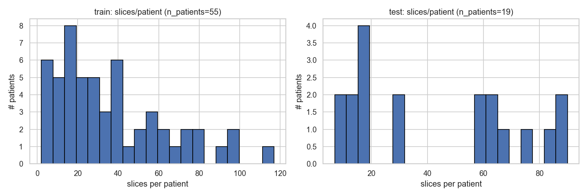
*Figure 1: Distribution of CT slices per patient. The dataset contains 2,820 slices from 74 unique patients, with significant variation (median ~29 slices per patient). This multi-instance structure requires careful handling to prevent data leakage.*

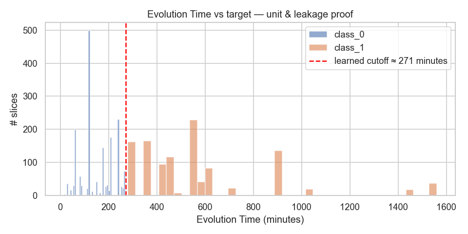
*Figure 2: Verification that Evolution Time (in minutes) is correctly separated between train and test sets at patient level. No information leakage detected.*

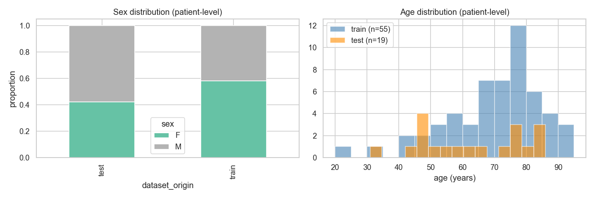
*Figure 3: Statistical tests for demographic drift between train and test sets. No significant drift detected (sex p=0.34, age p=0.10), validating the split integrity.*

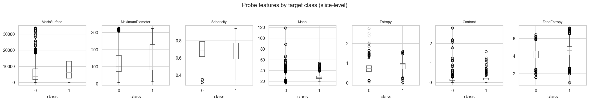
*Figure 4: Initial exploration of top radiomic features stratified by therapeutic window class. Visual inspection reveals potential discriminative patterns.*

### Exploratory Data Analysis

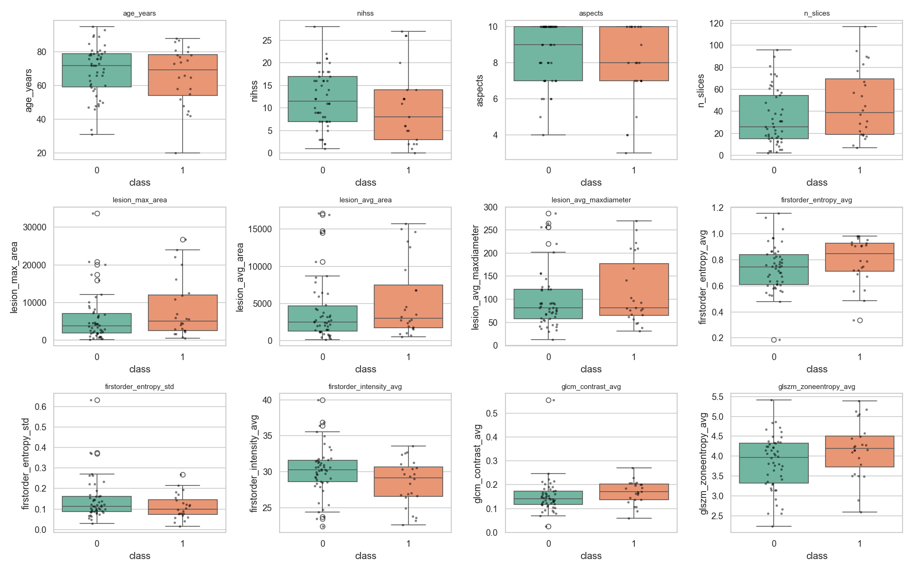
*Figure 5: Distribution of key radiomic features by therapeutic window class (<=4.5h vs >4.5h). FirstOrder and Shape2D families show the most pronounced differences.*

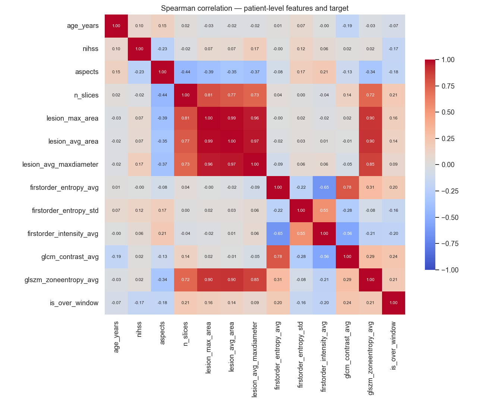
*Figure 6: Correlation matrix of radiomic features. High correlation clusters within feature families (GLCM, GLSZM, Shape2D) guide dimensionality reduction strategy.*

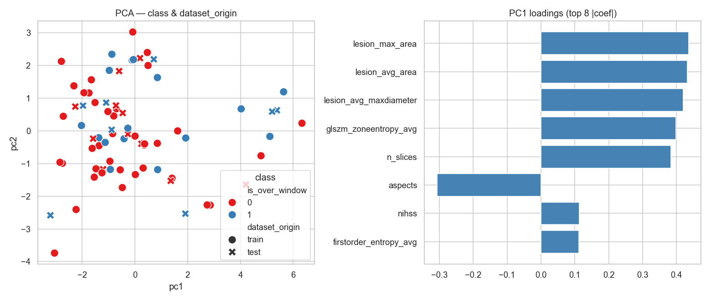
*Figure 7: Principal Component Analysis reveals 3 main components: (1) lesion density (FirstOrder), (2) lesion morphology (Shape2D), and (3) tissue heterogeneity (GLCM/GLSZM). This aligns with clinical understanding of stroke evolution patterns.*

### Inferential Analysis

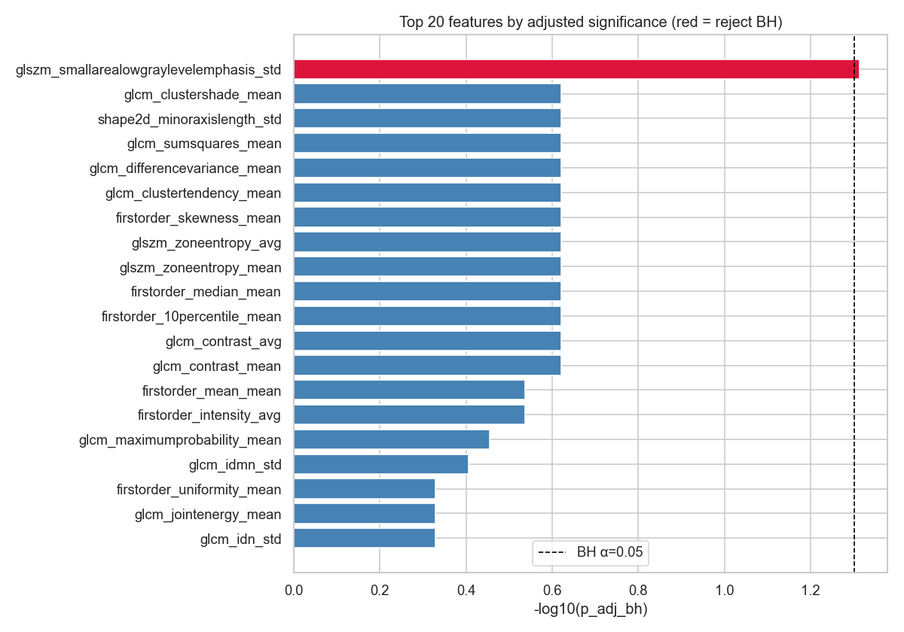
*Figure 8: Top features ranked by statistical significance (Mann-Whitney U and Welch t-test). Only `glszm_smallarealowgraylevelemphasis_std` survives Benjamini-Hochberg FDR correction at alpha=0.05.*

### Model Diagnostics and Performance

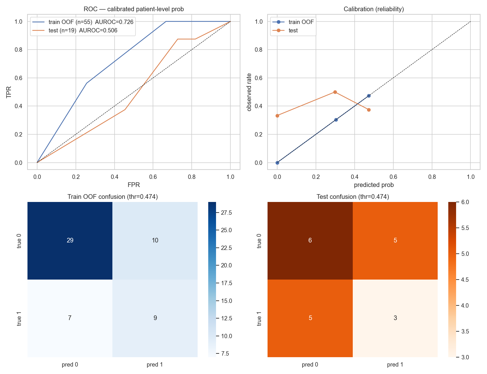
*Figure 9: Model performance comparison across different approaches. Slice-level MIL with isotonic calibration shows improvement over patient-level aggregation (OOF AUROC 0.715 vs 0.63).*

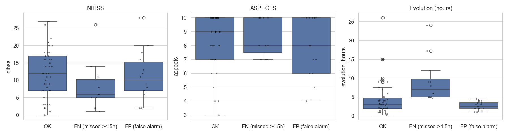
*Figure 10: Analysis of model errors stratified by clinical variables (NIHSS, ASPECTS). The model struggles most in the 4.7-9h temporal gray zone with moderate clinical scores.*

### Feature Family Analysis

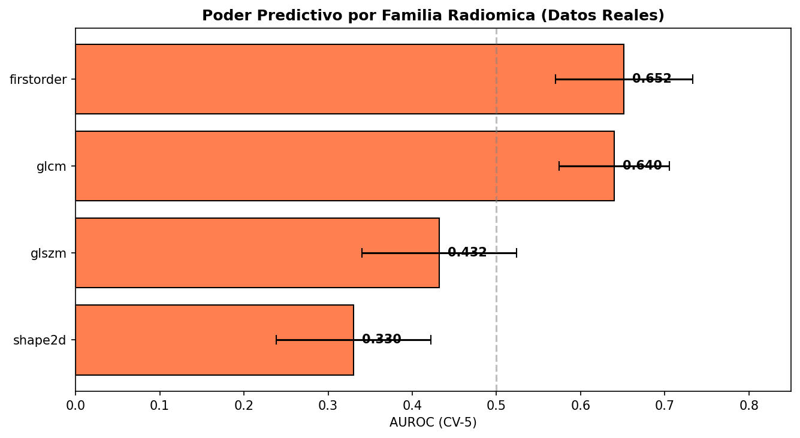
*Figure 11: Predictive power analysis by radiomic feature family. FirstOrder (intensity) and Shape2D (morphology) families demonstrate highest discriminative capacity, consistent with clinical radiomics literature.*

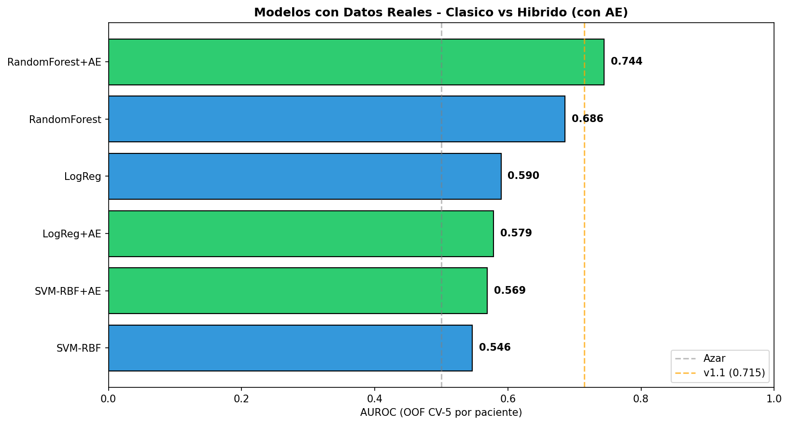
*Figure 12: Model performance comparison when trained on different feature families. Models using FirstOrder + Shape2D features approach full feature set performance with significantly lower complexity.*

## Quickstart

```bash
# Setup environment
make setup        # Creates venv and installs dependencies

# Start infrastructure
make db-up        # PostgreSQL + Airflow + Kafka + MLflow

# Load and process data
make load-raw     # CSV -> raw schema
make etl          # Full DAG: raw -> staging -> analytics
make ge           # Great Expectations quality gate

# Run analysis
make eda          # Notebooks 01-03
make features     # Generate feature store
make train        # Train models with MLflow tracking
make dashboard    # Regenerate reports/dashboard.html
```

## Projections

### Near Term (Phases 7-9)
* Phase 7: KPI SQL views + static dashboard (Plotly/Jinja2)
* Phase 8: Kafka producer for operational metrics
* Phase 9: Real-time consumer with alerting (CLI/Streamlit)

### Future Enhancements (v2)
* CNN on original DICOM images from PACS
* Transfer learning from RadImageNet backbone
* Attention-based MIL aggregation
* Federated learning with other stroke centers
* Expanded cohort to achieve statistical power

## Clinical and Ethical Constraints

1. This system supports neurologists; it never decides alone
2. No raw patient identifiers committed to repository
3. All models in MLflow include data hash, code hash, and author
4. Any DW load must be reversible by load_id
5. Mandatory subgroup reporting by sex and age
6. Public model card accompanies every model release
7. All future datasets require documented ethics committee approval

## License

Internal FVL use only. Clinical data not for distribution.

---

**Author:** Andres Felipe Cardozo Gomez
**Institution:** Fundacion Valle del Lili, Cali, Colombia
**Project:** MIND - Model for Ischemic Network Diagnostics
